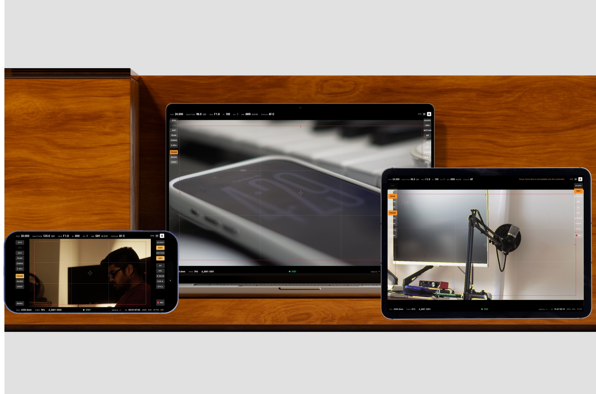

# CinemaHUD



A native macOS, iPhone and iPad app that turns a Sony α6400 into a remote-monitored cinema camera: live view
with a cinema-style HUD for shutter, iris, ISO, white balance, EV and focus, plus
click-to-focus, still capture, movie record, focus peaking, zebras, framing guides and cinema
aspect crops that fill an ultrawide monitor.

It connects either over **USB** (the camera's "PC Remote" mode, PTP with Sony's extensions,
driven directly through IOUSBHost) or over the camera's own **Wi-Fi** (the Sony Camera Remote API,
the same protocol PlayMemories Mobile / Imaging Edge Mobile use). No Sony software or drivers required.

## Using it

### USB (recommended: lowest latency, no dropouts)

1. **Camera:** MENU → Setup → *USB Connection* → **PC Remote**. Turn the mode dial to M (or Movie M).
2. Connect the USB cable, open **CinemaHUD**, click **Connect USB**.

If the camera mounts as a drive instead, it is still in Mass Storage mode: eject it, change the
setting, and reconnect. If macOS's Image Capture or Photos has grabbed the camera, quit them and replug.

### Wi-Fi

1. **Camera:** MENU → Network → *Ctrl w/ Smartphone* → **On**, then *Connection*.
   The screen shows an SSID like `DIRECT-xxxx:ILCE-6400` and a password.
2. **Mac:** join that Wi-Fi network.
3. Click **Discover**. If nothing is found, type `192.168.122.1:8080`
   into the address box and click **Connect** (that is the camera's fixed address in this mode).

The app drops stale frames and always shows the newest one, and reconnects by itself if the
link hiccups.

### First launch on macOS

The DMG is ad-hoc signed, not notarized. macOS will refuse to open it the first time.
Either right-click the app → **Open** → **Open**, or go to System Settings → Privacy & Security
and click **Open Anyway**. macOS will also ask for **Local Network** permission the first time you
click Discover; allow it.

### Controls

| Action | Where | Key |
|---|---|---|
| Change FPS, shutter, iris, EI, EV, WB, focus mode | click a top-strip readout, or scroll over it | |
| Autofocus (half-press) / AE lock | AF, AEL (right column) | Space |
| Manual focus nudge (USB, MF/DMF) | NEAR / FAR, or the menu's focus drive row | |
| Take a still | STILL | Return |
| Start / stop movie recording | REC | R |
| Set AF point (Wi-Fi) | click on the picture | |
| Frame lines / 2.39 guide / crop | FRAME, GUIDE, CROP (left column) | G, F, 1–9, 0 |
| Focus peaking / zebras / false color | PEAK, ZEBRA, EXP | P, Z, V |
| 2× magnify | 2.00× | X |
| Scopes: waveform, RGB parade, RGB histogram, vectorscope | SCOPE cycles | W |
| Picture profile / LOG ↔ 709 view / custom .cube LUT | profile badge, LOG/709 button, Overlays menu | L |
| Shot assist advisories with one-click fixes | ASSIST button, rows under the exposure strip | — |
| Mist diffusion look (display only) | MIST button | — |
| Enhanced upscaling (MetalFX + detail recovery) | ENH | E |
| Smooth motion ×2 / ×4 / ×8 (30 / 60 / 120 fps) | MOTION cycles | M |
| Live denoise NR1 / NR2 (temporal, motion-compensated) | NR cycles | D |
| Camera menu (drive, metering, DRO, flash, focus area, image size, aspect, picture effect, …) | MENU | N |
| Rotate display for vertical mounting | Aspect menu | T |
| Hide the HUD | | H |
| Full screen | View › Enter Full Screen | ⌃⌘F |

### Photo mode

Turn the mode dial to a still position and the app switches to **Photo mode** (Tab forces either mode
until the dial moves). The display follows the camera body's own LCD: mode badge, shots remaining,
RAW+J badge and battery across the top; focus mode and area on the left; shutter, aperture, EV and ISO
along the bottom (click or scroll to change). Sony's focus dot sits bottom-left, green when focus is
confirmed, and a small bar next to it shows how sharp the AF region is on the live view.

**Every shot is transferred to the Mac as it is taken**, whether you press the shutter in the app or on
the camera, and saved to `~/Pictures/CinemaHUD/<yyyy-MM-dd>/` under the camera's own filename. Over USB
both the JPEG and the RAW (ARW) arrive; on the camera set *File Format* to RAW+JPEG and
*Still Img. Save Dest.* to **PC** or **PC+Camera**. Over Wi-Fi Sony's remote API only sends the JPEG.

The moment the JPEG lands it replaces the live view for **review**: the real full-resolution image
with a 100 % loupe on the AF point and a focus verdict (IN FOCUS / SOFT / MISSED, with a marker where
the image is actually sharpest). Click to move the loupe, scroll to zoom, drag to pan, R switches
between JPEG and RAW once both are in, ← / → step through the shots, Escape returns to live view.
Return or Space fire the shutter or AF and leave review too. Thumbnails of the session's shots sit
along the bottom of the live view.

### The monitor

The layout follows a cinema viewfinder. The top strip carries exposure: FPS (project), SHUTTER
as an angle with the speed beside it, IRIS, EI, EV, WB with the green/magenta shift as CC, and
FOCUS, plus the profile badge, the exposure mode and the camera index. The bottom strip carries
status: FCL (focal length, USB), PWR, reel and clip (the clip number is the take counter), STBY
in green or REC in red with duration, MEDIA remaining and free-running TC. Tool columns sit on
the edges of the picture; an active tool is orange. Frame lines are red action-safe lines with
edge ticks; recording adds a red border.

### Log, LUTs and picture profiles

The α6400 does not expose Picture Profile over its remote protocol, so it cannot be switched from
the Mac. Set PP7 (S-Log2), PP8/PP9 (S-Log3) or PP10 (HLG) on the camera, then tell the monitor
with the profile badge. **LOG/709** toggles between the flat feed and the built-in conversion to
Rec.709 (S-Log3/S-Gamut3.Cine, S-Log3/S-Gamut3, S-Log2/S-Gamut, HLG/BT.2020 with a soft highlight
roll-off). **Load .cube LUT…** applies your own 3D LUT instead. Scopes read the picture after the LUT.

**Shot assist** (Mac, video): the monitor measures faces, focus, clipping and horizon on the live
picture and shows one or two advisories under the exposure strip — "FACE 1 STOP UNDER · EI 800 → 1600",
"FOCUS OFF SUBJECT · AF ON FACE", "SHUTTER 17° · 1/500 → 1/48" — each applied with one click. On
macOS 26 with Apple Intelligence, the on-device model phrases them (marked AI); elsewhere the plain
facts show. Nothing leaves the Mac. ASSIST in the left column turns it off. When the shot is clean it
nudges toward a more cinematic image instead: open the iris for a soft background, or turn on MIST.

**MIST** (right column, MIST1 / MIST2) is a display-only diffusion look: highlights bloom into a soft
halo and skin softens, the way a Pro-Mist filter renders. The camera records clean; zebras, false
colour and the scopes keep reading the unmisted picture, and NATIVE goes off in the bottom strip
while it is on.

### Vertical and social formats

CROP cycles through 1:1, 4:5 and 9:16 as well as the cinema ratios, trimming the sides so you frame
for Reels, Stories or feed posts. If the camera is mounted sideways in a cage, rotate the display
by 90° or 270° (T); touch AF coordinates are mapped back to the sensor.

### Enhanced mode

**ENHANCE** (E) renders the live view through Apple's MetalFX spatial upscaler on the GPU,
reconstructing edges when the 1024×680 feed is stretched to a 4K or Retina display. It adds no
latency. On GPUs without MetalFX, or when the window is smaller than the feed, it falls back to
Lanczos resampling. The top bar shows the output resolution and which path is active (MFX or
LANCZOS). It is a nicer picture, not a truer one: the camera still sends 1024×680, so it will
not reveal detail or focus the sensor feed does not contain. Frame rate is unchanged.

### Smooth motion

**MOTION** multiplies the displayed frame rate, ×2, ×4 or ×8 (30, 60 or 120 fps from the
camera's 15), by synthesizing the frames between each pair of real frames: Vision computes dense
optical flow once per pair and a Metal kernel warps both real frames to each in-between time.
Because the in-betweens need the following frame, the picture is shown one input frame later
(about 66 ms at 15 fps); the bottom strip shows the multiplier and the added delay. ×8 only
matters on a 120 Hz (ProMotion) display. Motion looks smoother, but nothing new is captured;
turn it off when pulling critical focus.

### Live denoise

**NR** (D) is a temporal, motion-compensated noise reducer: every incoming frame is blended
with the previous cleaned frame warped along the optical flow, and the blend weight drops to
zero wherever the two disagree, so grain averages out while moving edges stay crisp. NR1 is
light, NR2 strong. It costs one flow computation per frame (about 20 ms) and no extra delay.
Like every monitor tool, it changes only what you see, not what the camera records.

### Colour accuracy

The monitor is colour managed end to end. The camera's live view is an sRGB JPEG; the app tags it
as such (or as Rec.709 / BT.1886 if you choose "Interpret Feed As" in the Overlays menu) and macOS
converts it to the connected display's ICC profile, so a P3 MacBook panel and a calibrated external
monitor both show the same intended colours. The enhanced Metal path is tagged the same way and was
measured to match the plain path within 1/255. Nothing alters the picture unless you switch it on:
the bottom strip shows **NATIVE** when no LUT, effect, denoise, interpolation or sharpening is active.
For the most faithful view on an external monitor, use its sRGB or Rec.709 preset, or a calibrated profile.

### GPU pipeline

Every per-pixel stage runs on the Mac's GPU and stays there: the decoded frame is uploaded once,
Core Image applies the LUT, false colour, zebras, peaking and rotation as one lazy graph rendered
directly into the Metal renderer's texture, MetalFX (or Lanczos) scales it to the display, the
optional detail pass runs as a compute kernel, and the layer is presented colour-managed. Motion
interpolation and denoise output Metal textures that are wrapped without copying. Scopes sample a
256×96 tile the GPU downscales. Measured on the simulator feed: enhance + LUT + waveform dropped
from 72% to about 14% of one CPU core; motion ×4 with denoise sits near 45%, which is the optical
flow scheduling and the 60–120 frames per second of view updates, not pixel work.

### Wi-Fi performance

The processing path is identical over Wi-Fi; the difference is the link. The camera's Wi-Fi
serves the same 1024-wide JPEG stream, typically at a lower and less steady rate than USB, with
100–300 ms of latency and occasional stalls. The app always shows the newest frame (no backlog),
restarts the stream and re-runs the handshake automatically on a drop, and the interpolator
adapts to whatever rate arrives. Expect fewer real frames per second than USB, more delay, and
identical colour and tools. Stay within a few metres with line of sight; the camera's radio is
the limit, not the Mac.

### What "true quality" means here

The recording is not affected by any of this. The camera writes its full 4K or 1080p file
internally; the Mac only receives a 1024-pixel-wide monitoring stream. ENHANCE makes that
stream look as close to the recording as a real-time GPU pipeline can: temporal denoise first
(if NR is on), MetalFX edge-aware reconstruction to the display resolution, then an edge-gated
detail-recovery pass that raises local contrast only where there is real structure. It cannot
invent detail the stream never contained, so judge critical focus with PEAK and 2× magnify, and
judge exposure with the scopes and false color, which read the actual pixel values.

### Live view quality and frame rate

The α6400 generates its remote live view at 1024×680. Over USB the body delivers it at 15 fps,
which is the camera's limit for this protocol, not the app's. The app polls continuously and
displays each frame as soon as it arrives. For full-resolution, 30/60 fps monitoring use the
camera's HDMI output into a UVC capture device; that is the next planned video source.

### Verified on hardware (α6400, firmware 2.00, USB)

Connect, live view, shutter / iris / ISO stepping (lands on the nearest value the current mode
offers), movie record start/stop with true recording state, battery. Touch AF is Wi-Fi only.
Still capture and half-press AF over USB are implemented but were only exercised in movie mode,
where the body ignores them; test them in a stills mode.

Photo mode: RAW+JPEG transfer, body-triggered transfer, auto review and the focus verdict have been
exercised against the simulator only; hardware verification pending.

## iPhone and iPad

`iOS/CinemaHUDMobile.xcodeproj` (generated from `iOS/project.yml` with XcodeGen) builds a touch-first
field monitor for iOS 17+ on the shared `CinemaUI` and `SonyCameraKit` modules. It works in any
orientation: landscape puts tool rails on the sides and exposure along the bottom; portrait puts the
picture on top and a control deck below. A VIDEO | PHOTO switch sits in the top band (over Wi-Fi it
also moves the camera's shoot mode; over USB / bridge the body's dial decides). Sheets cover
**Guides** (thirds, centre, safe areas, diagonals, frame lines with a ratio picker), **Focus**
(AF mode, manual focus wheel and steps over USB / bridge, peaking with colour, 2× magnify, sharpness
meter), **Zoom** (W/T rocker for power-zoom lenses over Wi-Fi) and **Format** (still size / aspect,
movie quality and file format where the camera exposes them). Settings holds display options,
About, the Privacy Policy and the Terms of Use. Captures the camera hands over are saved under
CinemaHUD in the Files app. Tap a readout for its list, swipe up or down on it to step like a dial,
tap the picture to focus.

Two ways to connect:

- **Mac bridge (recommended).** iPhones and iPads cannot talk to the camera over USB, so keep the
  camera on the Mac by USB and let the Mac share it. The Mac app advertises itself on the local
  network as soon as a camera is connected (Camera menu → *Share Camera to iPhone / iPad*, on by
  default). The iOS app lists Macs it finds; tap one. The Mac re-serves the camera's own JPEG
  frames untouched plus state and every control, so the iPad sees exactly what the Mac sees with
  USB reliability, and all processing runs on the iPad's GPU.
- **Camera Wi-Fi directly.** Same as the Mac: Ctrl w/ Smartphone on the camera, join its network.
  JPEG stills only; no RAW over this path.

Run it: open the project in Xcode, pick a simulator or your device (select your team under
Signing), and press Run. In the Simulator, `CINEMAHUD_ADDRESS=127.0.0.1:8080` or
`CINEMAHUD_BRIDGE=http://127.0.0.1:8899` as scheme environment variables connect to the camera
simulator or to the Mac app running on the same machine.

Bridge protocol (plain HTTP on port 8899, Bonjour `_cinemahud._tcp`): `GET /state` (JSON),
`GET /events` (server-sent state changes), `GET /stream` (MJPEG-style framed JPEG bytes),
`POST /cmd` (`{"op":"setISO","value":"800"}`). Any client can use it.

## Building

Requires Xcode 15+ command line tools (Swift 5.9+) and macOS 14+.

```sh
swift test                 # unit tests for the protocol layer
./scripts/build-dmg.sh     # → build/CinemaHUD.app and build/CinemaHUD.dmg
```

### Developing without a camera

`tools/camerasim.py` is a fake α6400 (needs Python 3 with Pillow). It answers SSDP discovery,
JSON-RPC and streams a synthetic live view whose brightness follows the exposure settings.

```sh
python3 tools/camerasim.py                       # JSON-RPC on :8080
CINEMAHUD_ADDRESS=127.0.0.1:8080 swift run CinemaHUD
```

Simulator flags: `--stills` (mode dial on a still position), `--pz` (power-zoom lens),
`--photo photo.jpg` (serve a still photo as the live view; try one with a face for Shot assist).

Other development environment variables: `CINEMAHUD_WINDOW=WxH`, `CINEMAHUD_OVERLAYS=peaking,zebra,crop=2.39,hidehud`,
`CINEMAHUD_SNAPSHOT=/path.png` (renders the window to a PNG), `CINEMAHUD_QUIT=1`, `CINEMAHUD_TRACE=1`
(logs frame and assist decisions).

### Checking a real camera

```sh
tools/probe.sh                     # Wi-Fi: versions, available APIs, first event, liveview URL
swift run usbprobe                 # USB: device info, every property, one liveview frame, fps
swift run usbprobe --set shutter=1/50 --rec --af --shoot --watch   # exercise controls
PTP_DEBUG=1 swift run usbprobe     # trace every PTP transaction
```

## Layout

- `Sources/SonyCameraKit` — protocol library. `CameraBackend` abstracts the transport; `WiFiBackend` (SSDP discovery, JSON-RPC client, liveview stream parser) and `USB/SonyUSBBackend` (IOUSBHost transport, PTP transactions, Sony SDIO handshake, property parsing, notch stepping) both feed `CameraSession`, the observable object the UI talks to.
- `Sources/usbprobe` — command-line hardware probe for the USB path.
- `Sources/CinemaUI` — the shared SwiftUI monitor (Mac and iOS): connect screen, monitor and photo views, HUD strips and tools, Core Image pipeline, Metal renderer, LUTs.
- `Sources/CinemaHUD` — the macOS app shell: menus, keyboard shortcuts, dev hooks.
- `Sources/SonyCameraKit/Bridge` — Mac-side bridge server, iOS-side bridge client, Bonjour discovery.
- `iOS/` — the iPhone / iPad app target.
- `Tests/SonyCameraKitTests` — parser, event decoding, request encoding, device description parsing.
- `tools/camerasim.py` — fake camera. `tools/probe.sh` — hardware check.
- `scripts/build-dmg.sh` — release build, `.app` assembly, ad-hoc codesign, DMG.
- `docs/superpowers/specs/` — design spec.

## Status

USB path verified on a physical α6400. Wi-Fi path built to the published Camera Remote API and
exercised end to end against the simulator; not yet verified on the body.
